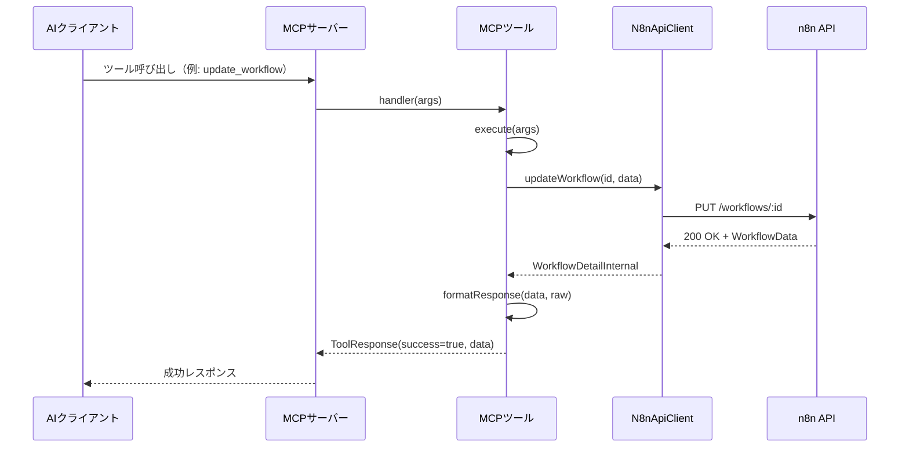
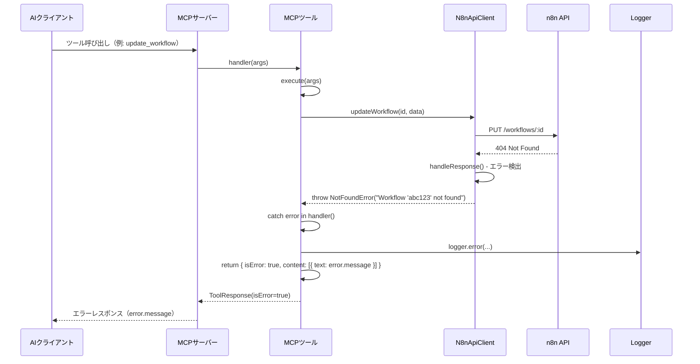

# プロジェクト全容ドキュメント

## プロジェクト概要
- **プロジェクト名**: MCPツールのエラーレスポンス強化
- **目的と背景**:
  - 現在、MCPツールのエラーレスポンスが「Failed to update workflow」のような曖昧なメッセージのみを返している
  - AIクライアント（Claude Code）がエラーの原因を特定できず、適切な対処やユーザーへの説明ができない
  - エラー情報（HTTPステータス、詳細メッセージ、影響箇所）がツールハンドラーでロストしている
- **主要な目標**:
  - BaseToolでエラーをキャッチして、エラーメッセージをAIクライアントに返す
  - CustomErrorが既に持っている適切なメッセージを活用
  - デバッグ効率を向上させる詳細なエラーログ出力

## スコープ
- **対象範囲**:
  - BaseToolのhandler()にエラーハンドリング追加
  - CustomErrorクラスのcontext型を厳密化（型安全性向上）
  - エラーログ出力の標準化

- **対象外の範囲**:
  - n8n APIクライアント層のエラーハンドリング（既に実装済み）
  - Zodバリデーションエラー（MCPフレームワークが適切に処理）
  - リトライロジックの追加（既存のリトライ機構を変更しない）

## 主要機能
1. **エラーレスポンスの返却**: BaseToolでエラーをキャッチし、error.messageをAIクライアントに返す
2. **エラーログの標準化**: 全ツールで一貫したログフォーマット
3. **CustomErrorの型安全性向上**: context プロパティに厳密な型定義を追加

## Phase概要と依存関係

### Phase 1: BaseToolエラーハンドリング実装
- **開始日時**: 2025-11-03 11:55
- **完了日時**: 2025-11-03 12:00
- **状態**: 完了
- **目標**:
  - TDDサイクルでBaseToolのhandler()にエラーハンドリングを追加
  - CustomErrorのcontext型定義を実装と同時に厳密化
  - エラーログ出力の実装
- **TDDサイクル**:
  - Red: handler()のエラーケーステスト作成（NotFoundError、ApiError、ValidationError、Unknown Error）
  - Green: handler()のtry-catch実装 + 必要なCustomError型定義の厳密化を同時に実施
  - Refactor: エラーレスポンス形式とログ出力の最適化
- **依存関係**: なし
- **成果物**:
  - `src/tools/base/base-tool.ts` - 更新版（try-catch追加）
  - `src/errors/custom-errors.ts` - 更新版（厳密な型定義、実装と同時）
  - `tests/tools/base/base-tool.test.ts` - エラーハンドリングテスト

### Phase 2: 個別ツールのエラーケース検証
- **開始日時**: 2025-11-03 12:06
- **完了日時**: 2025-11-03 12:16
- **状態**: 完了
- **目標**:
  - 10個の既存ツールで実際のエラーシナリオが正しく処理されることを検証
  - 既存テストの修正（エラーレスポンス形式変更に対応）
- **TDDサイクル**:
  - Red: 各ツールのエラーケーステスト作成（モックされたn8nクライアント）
  - Green: 必要に応じてツール実装を調整
  - Refactor: 既存テストの修正とリファクタリング
- **依存関係**: Phase 1のBaseToolエラーハンドリング実装完了が必須
- **成果物**:
  - `tests/tools/implementations/*.test.ts` - 更新された既存テストファイル
  - E2Eテスト追加

### Phase 3: ドキュメント更新と品質検証
- **開始日時**: 2025-11-03 12:16
- **完了日時**: 2025-11-03 12:18
- **状態**: 完了
- **目標**:
  - CLAUDE.mdへのエラーレスポンス仕様追記
  - 全品質チェックツール（lint、type-check、test）の実行と修正
- **依存関係**: Phase 2の個別ツール検証完了が必須
- **成果物**:
  - 更新された`CLAUDE.md`
  - 全品質チェック合格レポート

## Phase依存関係図
```
Phase 1 (BaseToolエラーハンドリング実装)
    ↓
Phase 2 (個別ツールのエラーケース検証)
    ↓
Phase 3 (ドキュメント更新と品質検証)
```

## シーケンス図

### 成功時のフロー（変更なし）


### エラー時のフロー（改善後）


## 成果物
1. **BaseToolのエラーハンドラー**: try-catchでエラーをキャッチし、error.messageを返す
2. **厳密なCustomError型定義**: context プロパティに型安全性を追加
3. **エラーケーステスト**: 各エラー種別の自動テスト
4. **更新されたCLAUDE.md**: エラーレスポンス仕様の追記

## リスクと制約
- **リスク**:
  - エラーレスポンス形式変更により、既存テストが影響を受ける可能性（軽微）
  - CustomErrorのcontext型変更により、既存のエラー生成箇所の修正が必要

- **技術的制約**:
  - MCPフレームワークのToolResponse形式に準拠する必要がある
  - Zodバリデーションエラーの処理はMCPフレームワークに委ねる

- **ビジネス的制約**:
  - 全品質チェック（lint、type-check、test）を必ず通過すること

## プロジェクトステータス
- **ステータス**: 完了
- **完了日時**: 2025-11-03
- **概要**: MCPツールのエラーレスポンス強化を完了しました。BaseToolにエラーハンドリングを追加し、個別ツールのエラーケース検証、ドキュメント更新を実施しました。
