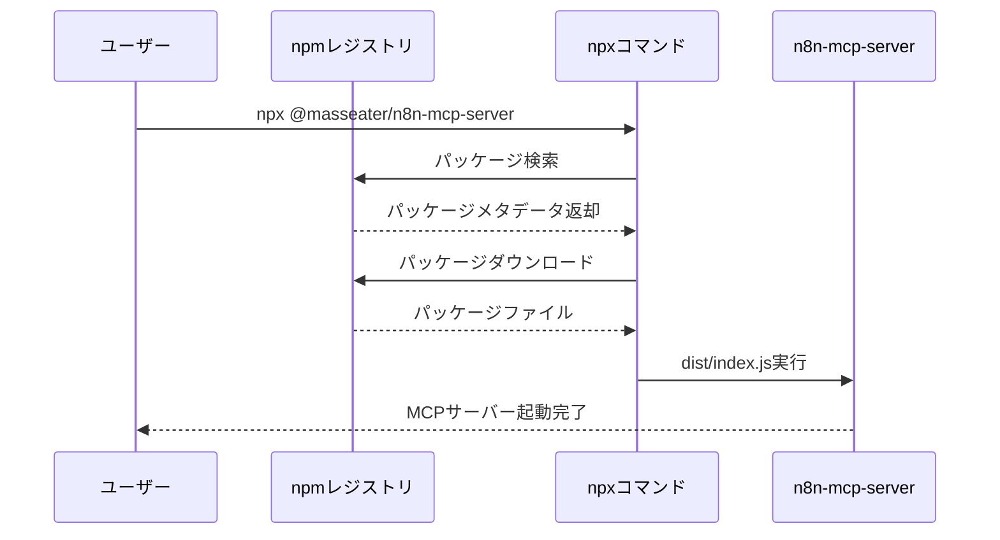
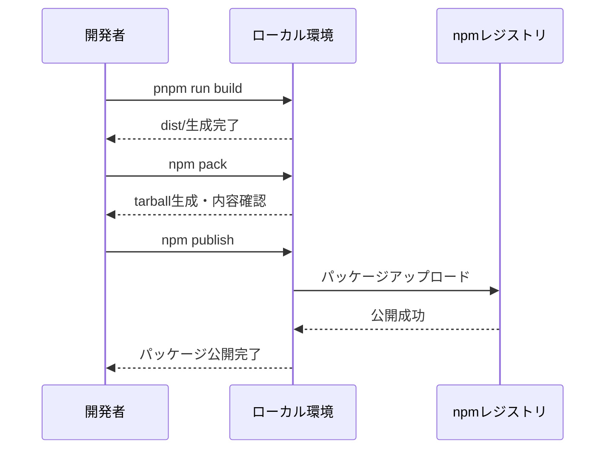

# プロジェクト全容ドキュメント

## プロジェクト概要
- **プロジェクト名**: n8n-mcp-server npm公開設定
- **目的と背景**: n8n-mcp-serverをnpmレジストリに公開し、`npx`コマンドで簡単にインストール・実行できるようにする
- **主要な目標**:
  - npmパッケージとしての公開設定を完了する
  - `npx @masseater/n8n-mcp-server` で実行できるようにする
  - ユーザーがローカルクローン不要で即座に利用可能にする

## プロジェクトステータス
- **ステータス**: 完了

## スコープ
- **対象範囲**:
  - package.json の npm公開用設定（files, bin, publishConfigなど）
  - TypeScriptビルド成果物の最適化
  - README.mdの更新（npm公開後のインストール手順）
  - GitHub Actionsでのnpm公開自動化（手動トリガーでバージョン指定）

- **対象外の範囲**:
  - 機能追加や既存コードの変更
  - テストコードの追加
  - ドキュメント以外のファイルの大幅な変更

## 主要機能
1. **npm公開設定**: package.jsonへのnpm公開用フィールドの追加
2. **実行可能ファイル設定**: binフィールドによるCLIコマンドの提供
3. **ファイル選択**: 公開に含めるファイルの最適化
4. **ドキュメント更新**: npm公開後のインストール・使用方法の記載

## Phase概要と依存関係

### Phase 1: npm公開設定の準備
- **開始日時**:
- **状態**: 未着手
- **目標**: package.jsonにnpm公開に必要な設定を追加する
- **依存関係**: なし
- **成果物**:
  - 更新されたpackage.json（bin, files, publishConfigフィールド追加）
  - .npmignore または package.json files フィールドによる公開ファイル制御

### Phase 2: ビルドとテスト
- **開始日時**:
- **状態**: 未着手
- **目標**: npm公開前のビルド確認とローカルテストを実施
- **依存関係**: Phase 1の完了が必須
- **成果物**:
  - ビルド成果物（dist/）の確認
  - `npm pack`によるパッケージ内容の検証
  - ローカル環境での`npx`実行テスト成功

### Phase 3: npm公開とドキュメント更新
- **開始日時**:
- **状態**: 未着手
- **目標**: npmレジストリへの公開とREADME更新
- **依存関係**: Phase 2の全テスト成功が必須
- **成果物**:
  - npm公開完了（`npm publish`実行）
  - 更新されたREADME.md（npxインストール手順追加）
  - GitHub Actions ワークフローファイル（.github/workflows/publish.yml）
  - CHANGELOG.mdは今回のスコープ外（将来的に作成する可能性あり）

**タスク番号形式について:**
- Phase内のタスクは番号で管理されます
- 並列実行するタスクはn.x形式（例: 2.1, 2.2, 2.3）で番号付けされます
- 単一番号のタスク（例: 1, 3）は前のタスクグループ完了後に実行されます
- このプロジェクトではPhaseごとに直列実行が基本となるため、複雑なタスク番号体系は不要

## Phase依存関係図
```
Phase 1 (npm公開設定の準備)
    ↓
Phase 2 (ビルドとテスト)
    ↓
Phase 3 (npm公開とドキュメント更新)
```

## シーケンス図

### npx実行フロー


### npm公開フロー


## 成果物
- npm公開済みのn8n-mcp-serverパッケージ（`@masseater/n8n-mcp-server`）
- npxコマンドで実行可能なCLIツール
- 更新されたREADME.md（npm公開後のインストール手順）
- GitHub Actions ワークフローファイル（手動トリガーでバージョン指定）

## リスクと制約
- **リスク**:
  - スコープ（@masseater/）の所有権確認が必要
  - 公開後のバージョン管理運用方法（GitHub Actionsの手動トリガーで対応）

- **技術的制約**:
  - Node.js 22.10.0以上が必要（package.json engines: `>=22.10.0`）
  - pnpmパッケージマネージャー使用
  - TypeScript → JavaScriptへのトランスパイルが必要

- **ビジネス的制約**:
  - 公開npmレジストリ（registry.npmjs.org）で公開
  - オープンソースライセンス（MIT）で公開
  - 2FAは無効（シンプルな認証フローを優先）
