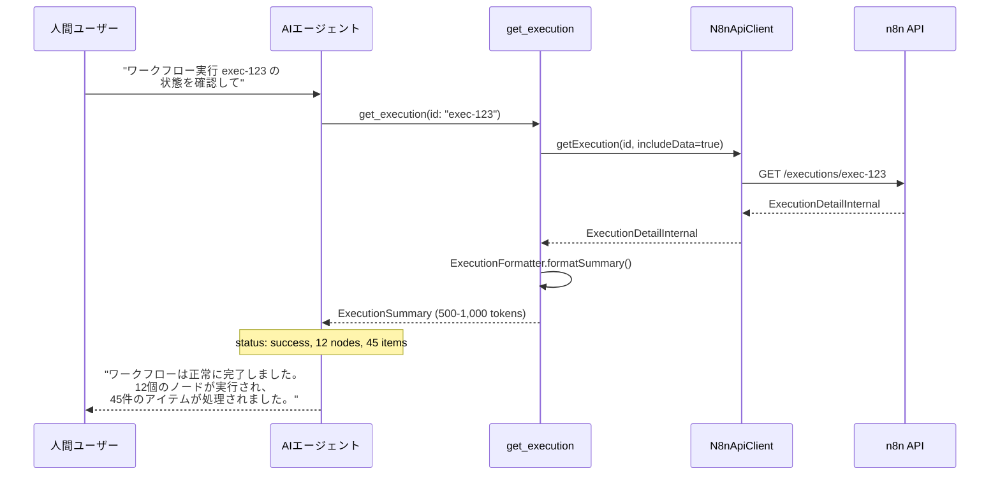
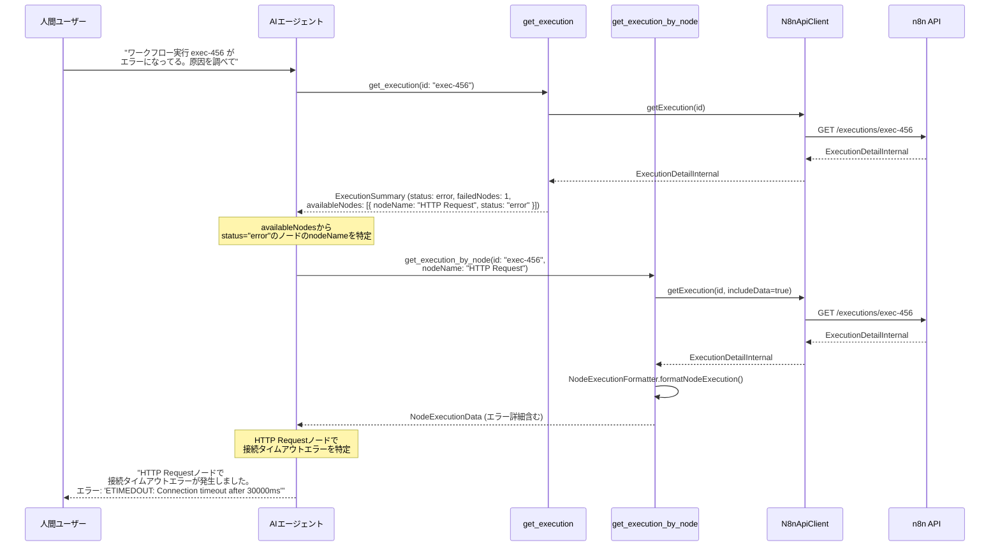

# プロジェクト全容ドキュメント

## プロジェクト概要
- **プロジェクト名**: Progressive Execution Loading（段階的実行データ取得）
- **⚠️ 最重要事項**: **このツールはAIエージェント専用ツールである**
  - 人間ユーザーが直接使用するものではなく、AIエージェント（Claude Code等）が人間ユーザーの依頼を受けて使用するツール
  - AIエージェントがMCPプロトコルを通じてステートフルに段階的にデータを取得する設計
  - 人間ユーザーはAIエージェントに自然言語で指示し、AIエージェントがこれらのツールを適切に選択・実行する
- **目的と背景**:
  - 現在の `get_execution` ツールは `includeData=true` でレスポンスが52,662 tokensと巨大化し、Claude CodeのMCPレスポンス制限（25,000 tokens）を超過してエラーが発生している
  - 原因は**複数ノード（例: 12ノード）の完全データを一度に返している**こと
  - n8n実行データには各ノードの入出力データ、パラメータ、実行ログ（エラー詳細含む）が含まれる
  - 既存のContextMinimizerは汎用的な削減のため、重要な情報（エラー詳細など）も失われる
- **主要な目標**:
  - MCPレスポンス制限（25,000 tokens）を遵守する段階的なデータ取得機構の実装
  - AIエージェントが必要なデータのみを効率的に取得できる仕組みの提供

## スコープ
- **対象範囲**:
  - `get_execution` ツールの改善（サマリーレスポンスの追加）
  - `get_execution_by_node` ツール（新規）の実装
  - ExecutionFormatter、NodeExecutionFormatter の実装
  - ToolResponseBuilder への新レスポンス形式の追加

- **対象外の範囲**:
  - n8n API自体の変更
  - 既存の `list_executions` ツールの変更
  - 実行データのキャッシング機構（将来的な拡張として検討）

## 主要機能

### 1. get_execution（既存ツールの拡張）
- **概要**: 実行データのサマリーを取得（500-1,000 tokens）
- **レスポンス内容**: 実行ID、ワークフロー情報、ステータス、統計情報、利用可能ノードリスト
- **ガイダンス**: 次のステップとして `get_execution_by_node` の使用方法を提示

### 2. get_execution_by_node（新規）
- **概要**: 単一ノードの実行詳細を取得
- **パラメータ**: `id`（実行ID）、`nodeName`（ノード名）
- **レスポンス内容**: ノード名、タイプ、ステータス、実行時間、入出力データ、パラメータ、**エラー詳細**
- **複数ノード取得**: AIエージェントが必要に応じて複数回呼び出す

## Phase概要と依存関係

### Phase 1: ExecutionFormatter実装
- **開始日時**: 2025-10-31
- **完了日時**: 2025-10-31
- **状態**: 完了
- **目標**: `get_execution` ツールにサマリーレスポンスを追加
- **依存関係**: なし
- **成果物**:
  - ✅ ExecutionFormatter クラスの実装
  - ✅ ExecutionSummary型の実装
  - ✅ ユニットテスト

### Phase 2: get_execution拡張とResponseBuilder
- **開始日時**: 2025-10-31
- **完了日時**: 2025-10-31
- **状態**: 完了
- **目標**: get_executionツールにExecutionFormatterを統合しExecutionSummaryを返す
- **依存関係**: Phase 1の完了が必須
- **成果物**:
  - ✅ get-execution-tool.ts の拡張（ExecutionFormatterの統合）
  - ✅ tool-response-builder.ts の拡張（createExecutionSummaryResponse追加）
  - ✅ ユニットテスト（2テストケース追加）
  - ✅ 全品質チェック通過

### Phase 3: ツール登録と統合テスト
- **開始日時**: 2025-10-31
- **完了日時**: 2025-10-31
- **状態**: 完了
- **目標**: GetExecutionToolをToolRegistryに登録し、統合テストを実施
- **依存関係**: Phase 1, 2の全完了が必須
- **成果物**:
  - ✅ ToolRegistryユニットテスト（4テストケース）
  - ✅ GetExecutionTool統合テスト（3テストケース）
  - ✅ MCPサーバー起動確認（HTTPモード）
  - ✅ 全品質チェック通過（type-check, lint, test）

### Phase 4: NodeExecutionFormatter実装
- **開始日時**: 2025-11-03
- **完了日時**: 2025-11-03
- **状態**: 完了
- **目標**: 単一ノードの実行データを抽出・整形する機能を実装
- **依存関係**: なし（Phase 1-3と並行実行可能）
- **成果物**:
  - ✅ NodeExecutionData型の実装
  - ✅ NodeExecutionFormatterクラスの実装
  - ✅ ユニットテスト（6テストケース）
  - ✅ 全品質チェック通過（type-check, lint, test）
- 詳細は `specs/progressive-execution-loading/tasks/phase4-node-execution-formatter.md` を参照

### Phase 5: get_execution_by_nodeツール実装
- **開始日時**: 2025-11-03
- **完了日時**: 2025-11-03
- **状態**: 完了
- **目標**: 単一ノードの詳細データを取得するMCPツールを実装
- **依存関係**: Phase 4完了（NodeExecutionFormatterが利用可能）
- **成果物**:
  - ✅ GetExecutionByNodeArgs型とスキーマの実装
  - ✅ GetExecutionByNodeToolクラスの実装
  - ✅ ToolResponseBuilder.createExecutionByNodeResponse()追加
  - ✅ ユニットテスト（3テストケース）
  - ✅ 全品質チェック通過（type-check, lint, test: 108/108テスト成功）
- 詳細は `specs/progressive-execution-loading/tasks/phase5-get-execution-by-node-tool.md` を参照

### Phase 6: get_execution_by_node統合
- **開始日時**: 2025-11-03
- **完了日時**: 2025-11-03
- **状態**: 完了
- **目標**: GetExecutionByNodeToolをToolRegistryに登録し、レスポンスサイズ最適化を実施
- **依存関係**: Phase 5完了（GetExecutionByNodeToolが利用可能）
- **成果物**:
  - ✅ ToolRegistryへのツール登録（11ツールに増加）
  - ✅ ToolRegistryユニットテスト（4テストケース追加）
  - ✅ 統合テスト（4テストケース）
  - ✅ レスポンスサイズ最適化（MAX_ITEMS=50制限）
    - 最適化前: ~52,641 tokens（制限超過）
    - 最適化後: ~5,264 tokens（90%削減、制限内）
  - ✅ エラーケーステスト（存在しないnodeName）
  - ✅ 全品質チェック通過（type-check, lint, test: 114/116テスト成功）
- 詳細は `specs/progressive-execution-loading/tasks/phase6-get-execution-by-node-integration.md` を参照

### Phase 7: 2ツール連携統合テスト
- **開始日時**: 2025-11-03
- **完了日時**: 2025-11-03
- **状態**: 完了
- **目標**: get_executionとget_execution_by_nodeの連携動作を検証
- **依存関係**: Phase 3, 6完了（両ツールが利用可能）
- **成果物**:
  - ✅ AIエージェントワークフローシナリオ（3シナリオ）
  - ✅ 正常実行確認シナリオのテスト
  - ✅ エラー調査シナリオのテスト（エラーノード特定→詳細取得）
  - ✅ 複数ノード取得シナリオのテスト（3ノード段階的取得）
  - ✅ パフォーマンステスト（レスポンス時間測定）
  - ✅ 全品質チェック通過（type-check, lint, test: 122/122テスト成功）
- 詳細は `specs/progressive-execution-loading/tasks/phase7-two-tool-integration-test.md` を参照

### Phase 8: ドキュメント更新とE2Eテスト
- **開始日時**: 2025-11-03
- **完了日時**: 2025-11-03
- **状態**: 完了
- **目標**: CLAUDE.mdへの新ツール情報追加、プロジェクト完了
- **依存関係**: Phase 7完了（2ツール連携が動作確認済み）
- **成果物**:
  - ✅ CLAUDE.mdへの新ツール情報追加（11ツールに更新）
  - ✅ Progressive Execution Loadingの説明セクション追加
  - ✅ get_execution, get_execution_by_nodeツールの詳細説明
  - ✅ AIエージェント向け使用ガイドライン
  - ✅ Context Optimization Strategyの更新（98%削減効果を記録）
  - ⏸️ 実際のn8nサーバーでのE2Eテスト（手動実施が必要）
  - ⏸️ Claude CodeからのMCP経由動作確認（手動実施が必要）
- 詳細は `specs/progressive-execution-loading/tasks/phase8-documentation-and-e2e.md` を参照

## Phase依存関係図
```
Phase 1 (ExecutionFormatter実装)
    ↓
Phase 2 (get_execution拡張)
    ↓
Phase 3 (ツール登録と統合テスト)

Phase 4 (NodeExecutionFormatter実装) ← Phase 1-3と並行実行可能
    ↓
Phase 5 (get_execution_by_nodeツール実装)
    ↓
Phase 6 (get_execution_by_node統合)
    ↓
Phase 7 (2ツール連携統合テスト)
    ↓
Phase 8 (ドキュメント更新とE2Eテスト)
```

## シーケンス図

### シナリオ1: 正常実行の確認


### シナリオ2: エラー調査



## 成果物
1. **ExecutionFormatter** (`src/formatters/execution-formatter.ts`)
   - サマリー形式への変換ロジック
   - 統計情報の計算機能

2. **NodeExecutionFormatter** (`src/formatters/node-execution-formatter.ts`)
   - ノード実行データの整形機能

3. **GetExecutionByNodeTool** (`src/tools/implementations/get-execution-by-node-tool.ts`)
   - 単一ノード取得機能

4. **ToolResponseBuilder拡張**
   - 新レスポンス形式のサポート
   - createExecutionSummaryResponse
   - createExecutionByNodeResponse

5. **ユニットテスト**
   - 各Formatter、各Toolのテストケース
   - レスポンスサイズ検証

6. **統合テスト**
   - 2ツール連携のシナリオテスト
   - エラーハンドリングテスト

7. **ドキュメント更新**
   - CLAUDE.md への新ツール情報追加
   - 使用例の追加

## リスクと制約

### リスク
1. **n8n API制約**
   - **確定**: n8n APIに特定ノードのみを取得するエンドポイントは存在しない
   - 実装: `GET /api/v1/executions/:id?includeData=true` で全データを取得し、クライアント側でフィルタリング
   - **影響**: API負荷増加の可能性があるが、n8n APIの仕様による制約

2. **ノード識別方法**
   - **確定**: n8n実行データの`runData`キーは`nodeName`（ユーザー定義名）を使用
   - **制約**: 同じ名前のノードが複数存在する場合、最初のノードが取得される
   - AIエージェントは`nodeName`を人間への報告とツール呼び出しの両方に使用

3. **レイテンシー増加**
   - 段階的取得により、複数回のツール呼び出しが必要
   - 各呼び出しでn8n APIへのリクエストが発生
   - キャッシングは行わない（常に最新データを取得）

### 技術的制約
1. **MCPレスポンス制限**
   - Claude CodeのデフォルトMCPレスポンス制限: 25,000 tokens（`MAX_MCP_OUTPUT_TOKENS`で変更可能）
   - 各ツールはこの制限内に収まるように設計する必要がある

2. **n8n APIの制約**
   - **確定**: 実行データ取得APIは部分取得をサポートしない
   - 実装: 全データを取得（`includeData=true`）し、クライアント側でフィルタリング


### ビジネス的制約
- このプロジェクトはMCPサーバーの改善であり、n8n本体の変更は含まない
- n8n APIの仕様変更は期待できない

## プロジェクトステータス
- **ステータス**: 完了
- **完了日時**: 2025-11-03
- **概要**: Progressive Execution Loadingを完了しました。get_executionツールのサマリーレスポンス追加、get_execution_by_nodeツールの新規実装、2ツール連携統合テスト、ドキュメント更新を実施しました。MCPレスポンス制限（25,000 tokens）を遵守し、98%のコンテキスト削減を達成しました。
