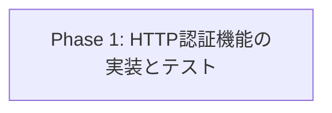
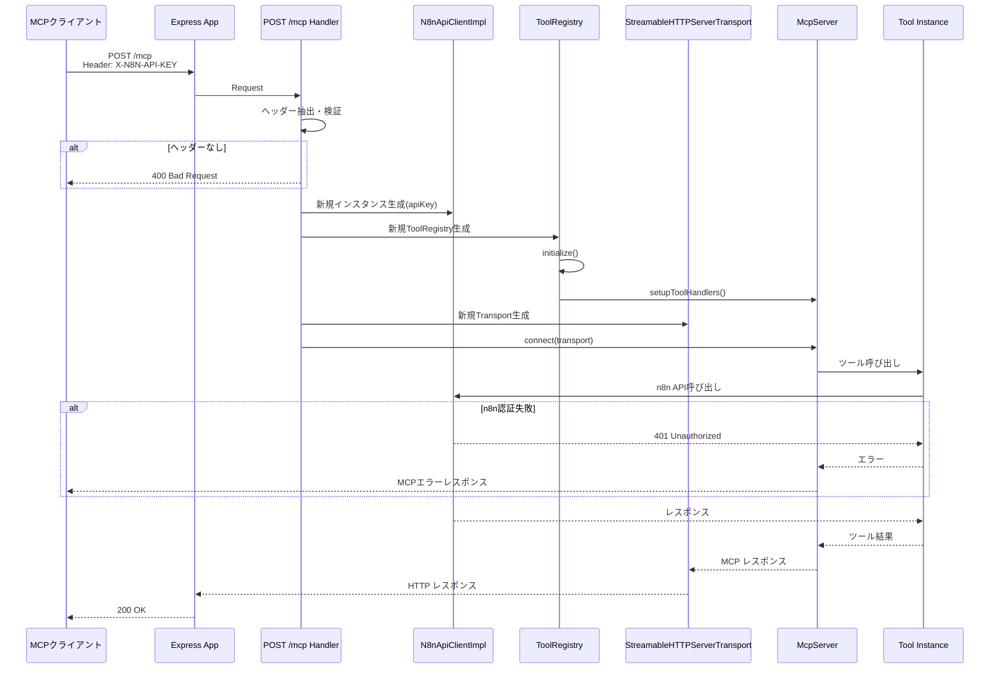

# HTTP Mode Authentication

## 目的
HTTPモードでMCPサーバーをホスティングする際に、クライアント（AIツール）からn8n API認証情報（API Key）をリクエストヘッダーで受け取り、動的にn8nへの認証を行えるようにする。これにより単一のn8nインスタンスに対して複数のアカウント（API Key）からのアクセスに対応可能なマルチテナント対応を実現する。

## スコープ
### 含まれるもの
- POST /mcpエンドポイントでクライアントからn8n API Key（X-N8N-API-KEY等のヘッダー）を受け取る仕組み
- リクエストごとにn8nクライアントを動的に初期化する機能（API Keyのみ動的、エンドポイントURLは固定）
- n8n認証失敗時のエラーハンドリング
- 環境変数N8N_API_KEYの廃止（N8N_URLは引き続き環境変数で設定）
- クライアントから送信すべきヘッダー仕様のドキュメント化

### 含まれないもの
- MCPエンドポイント自体の認証機能（Basic認証、API Key認証など）
- stdio transportの変更（stdioは既存仕様のまま）
- GET /healthエンドポイントの変更
- レート制限・DDoS対策（将来的な拡張として別タスクで検討）
- 複雑なユーザー管理機能（複数ユーザー、権限管理など）

## 想定される成果物
- リクエストヘッダーからn8n認証情報を抽出する機能
- リクエストごとにN8nApiClientを動的に初期化する実装
- 認証失敗時の適切なエラーレスポンス
- テストコード（ヘッダーなし、無効な認証情報、正しい認証情報のケース）
- CLAUDE.mdへのクライアント側実装ガイド追加（必要なヘッダー仕様など）

## Phase概要と依存関係

### Phase 1: HTTP認証機能の実装とテスト
- **開始日時**: 2025-11-10 19:30
- **完了日時**: 2025-11-10 19:48
- **状態**: 完了
- **目標**: POST /mcpエンドポイントでX-N8N-API-KEYヘッダーを受け取り、リクエストごとにN8nApiClientを動的に初期化する機能を実装し、動作を保証する
- **依存関係**: なし
- **成果物**:
  - ✅ ヘッダー抽出ロジック（src/server/mcp-server.ts:134-149）
  - ✅ リクエストスコープのMcpServerインスタンス生成
  - ✅ リクエストスコープのN8nApiClientインスタンス生成
  - ✅ リクエストスコープのToolRegistry生成
  - ✅ エラーハンドリング（ヘッダー不足時の400エラー）
  - ✅ 単体テスト（7テストケース全て通過）
  - ✅ CLAUDE.mdの更新（HTTP Mode Authenticationセクション追加）

## Phase依存関係図

## シーケンス図

