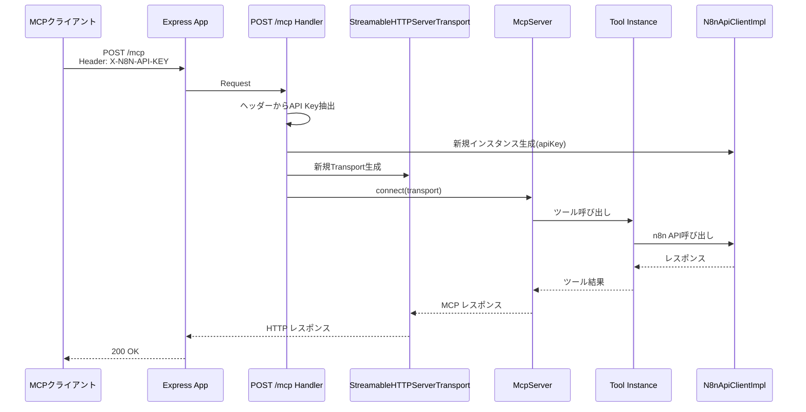
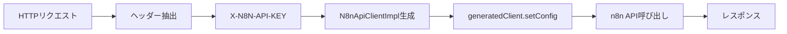

# 技術詳細ドキュメント

## アーキテクチャ

### システム構成図



### 技術スタック

`specs/_steering/tech.md` に準拠しています。

#### このタスク固有の変更点

なし。既存の技術スタックのみを使用。

## 技術選定

steering/tech.mdの標準技術を使用。

## データ設計

### データモデル

新規データモデルなし。既存の`N8nApiClientImpl`を拡張してリクエストスコープのインスタンス生成に対応。

### データフロー



## API設計

### エンドポイント一覧

| メソッド | パス | 説明 | 変更内容 |
|---------|------|------|---------|
| POST | /mcp | MCP protocol request | ヘッダー`X-N8N-API-KEY`を必須化 |
| GET | /health | ヘルスチェック | 変更なし |

### リクエスト/レスポンス仕様

#### POST /mcp

**変更点**: リクエストヘッダーに`X-N8N-API-KEY`を追加

- **入力**:
  ```
  Headers:
    X-N8N-API-KEY: <n8n API Key>
    Content-Type: application/json

  Body: MCP protocol request
  ```

- **出力**:
  ```json
  MCP protocol response
  ```

- **エラー**:
  - ヘッダー不足: 400 Bad Request
  - n8n認証エラー: n8n APIからのエラーをそのまま返す（既存のエラーハンドリング）

### 認証・認可

steering/tech.mdのセキュリティ要件に準拠。

- **認証方式**: n8n API Key（ヘッダー経由）
- **実装**: `N8nApiClientImpl.authenticate()`を使用せず、`generatedClient.setConfig()`で直接設定

## 実装詳細

### 変更箇所

#### src/server/mcp-server.ts

**現在のコード**（src/server/mcp-server.ts:109-121）:
```typescript
app.post("/mcp", async (req, res) => {
  const transport = new StreamableHTTPServerTransport({
    sessionIdGenerator: undefined,
    enableJsonResponse: true,
  });

  res.on("close", () => {
    void transport.close();
  });

  await this.server.connect(transport);
  await transport.handleRequest(req, res, req.body);
});
```

**変更後**:
```typescript
app.post("/mcp", async (req, res) => {
  // 1. ヘッダーからAPI Key抽出
  const apiKey = req.headers['x-n8n-api-key'];
  if (!apiKey || typeof apiKey !== 'string') {
    res.status(400).json({ error: 'X-N8N-API-KEY header is required' });
    return;
  }

  // 2. リクエストスコープのN8nApiClientを生成
  const n8nClient = new N8nApiClientImpl(
    this.config.n8n.baseUrl,
    this.config.n8n.timeout,
    this.config.n8n.retryAttempts
  );

  // 3. API Keyを設定（authenticate()は呼ばない）
  generatedClient.setConfig({
    baseUrl: this.config.n8n.baseUrl.replace(/\/$/, ''),
    headers: {
      'X-N8N-API-KEY': apiKey,
    },
  });

  // 4. リクエストスコープのToolRegistryを生成
  const toolRegistry = new ToolRegistry(
    this.server,
    n8nClient,
    this.responseBuilder
  );
  toolRegistry.initialize();
  toolRegistry.setupToolHandlers();

  // 5. 既存の処理
  const transport = new StreamableHTTPServerTransport({
    sessionIdGenerator: undefined,
    enableJsonResponse: true,
  });

  res.on("close", () => {
    void transport.close();
  });

  await this.server.connect(transport);
  await transport.handleRequest(req, res, req.body);
});
```

### 不明点

1. **ヘッダーが複数存在する場合の挙動**: 案A（最初の値を使用）を採用
2. **インスタンスのライフサイクル**: 案A（リクエストスコープ）を採用
   - リクエストごとに新しい`N8nApiClientImpl`と`ToolRegistry`を生成
   - レスポンス返却後は自動的にGC対象となる

### セキュリティ実装

- API Keyはリクエストスコープのみ保持
- n8n APIからのエラーは既存のエラーハンドリング機構（`BaseTool.handler()`）で処理

## パフォーマンス考慮事項

- リクエストごとに`N8nApiClientImpl`と`ToolRegistry`を生成するため、初期化コストが発生
- 大量リクエストが予想される場合はキャッシュ機構を検討（将来拡張）
