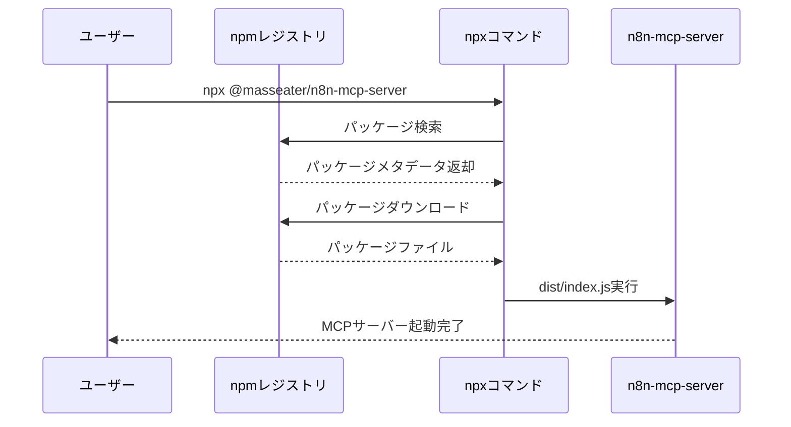
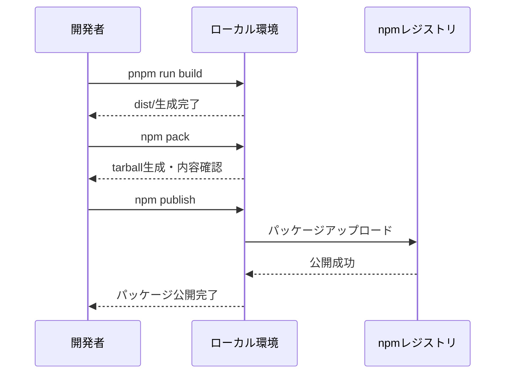

# プロジェクト全容ドキュメント

## プロジェクト概要
- **プロジェクト名**: n8n-mcp-server npm公開設定
- **目的と背景**: n8n-mcp-serverをnpmレジストリに公開し、`npx`コマンドで簡単にインストール・実行できるようにする
- **主要な目標**:
  - npmパッケージとしての公開設定を完了する
  - `npx @masseater/n8n-mcp-server` で実行できるようにする
  - ユーザーがローカルクローン不要で即座に利用可能にする

## スコープ
- **対象範囲**:
  - package.json の npm公開用設定（files, bin, publishConfigなど）
  - TypeScriptビルド成果物の最適化
  - README.mdの更新（npm公開後のインストール手順）
  - GitHub Actionsでのnpm公開自動化（手動トリガーでバージョン指定）

- **対象外の範囲**:
  - 機能追加や既存コードの変更
  - テストコードの追加
  - ドキュメント以外のファイルの大幅な変更

## 主要機能
1. **package.json基本メタデータ設定**: パッケージ名、バージョン、基本情報の設定
2. **binフィールドとCLI設定**: npxコマンドで実行可能なCLIエントリーポイントの設定
3. **filesフィールドと公開ファイル最適化**: 公開に含めるファイルの最適化と不要ファイルの除外
4. **publishConfig設定**: npm公開レジストリとアクセス設定
5. **ビルドとローカルテスト**: npm公開前のビルド確認とローカルテストの実施
6. **README更新**: npm公開後のインストール・使用方法の記載
7. **GitHub Actionsワークフロー**: npm公開を自動化する手動トリガーワークフローの作成
8. **npm公開実行**: npmレジストリへの実際の公開とnpmページでの動作確認

## Phase概要と依存関係

### Phase 1: package.json基本メタデータ設定
- **開始日時**: 2025-11-03
- **状態**: 完了
- **目標**: パッケージ名、バージョン、基本情報の設定
- **依存関係**: なし
- **成果物**:
  - name, version, description, keywords, author, license等の設定完了

### Phase 2: binフィールドとCLI設定
- **開始日時**: 2025-11-03
- **状態**: 完了
- **目標**: npxコマンドで実行可能なCLIエントリーポイントを設定
- **依存関係**: Phase 1の完了が必須
- **成果物**:
  - binフィールド追加、dist/index.jsへのパス設定完了

### Phase 3: filesフィールドと公開ファイル最適化
- **開始日時**: 2025-11-03
- **状態**: 完了
- **目標**: 公開に含めるファイルを最適化し、不要なファイルを除外
- **依存関係**: Phase 2の完了が必須
- **成果物**:
  - filesフィールド設定完了
  - .npmignore作成（必要に応じて）

### Phase 4: publishConfig設定
- **開始日時**: 2025-11-03
- **状態**: 完了
- **目標**: npm公開レジストリとアクセス設定
- **依存関係**: Phase 3の完了が必須
- **成果物**:
  - publishConfigフィールド追加完了

### Phase 5: ビルドとローカルテスト
- **開始日時**: 2025-11-03
- **状態**: 完了
- **目標**: ビルド確認、npm pack検証、ローカルnpxテスト
- **依存関係**: Phase 4の完了が必須
- **成果物**:
  - ビルド成果物（dist/）の確認完了
  - `npm pack`によるパッケージ内容の検証完了
  - ローカル環境での`npx`実行テスト成功

### Phase 6: README更新
- **開始日時**: 2025-11-03
- **状態**: 完了
- **目標**: npm公開後のインストール手順をREADMEに追加
- **依存関係**: Phase 5の完了が必須
- **成果物**:
  - 更新されたREADME.md（npxインストール手順追加）

### Phase 7: GitHub Actionsワークフロー作成
- **開始日時**: 2025-11-03
- **状態**: 完了
- **目標**: npm公開を自動化するワークフローを作成
- **依存関係**: Phase 6の完了が必須
- **成果物**:
  - .github/workflows/publish.yml作成完了

### Phase 8: npm公開実行
- **開始日時**: 2025-11-03
- **状態**: 実行可能（自動化済み、ワークフロー実行待ち）
- **目標**: GitHub Package Registryへの実際の公開
- **依存関係**: Phase 7の完了が必須
- **成果物**:
  - npm公開完了（`npm publish`実行）
  - GitHub Packagesページでの公開確認完了

**タスク番号形式について:**
- Phase内のタスクは番号で管理されます
- 並列実行するタスクはn.x形式（例: 2.1, 2.2, 2.3）で番号付けされます
- 単一番号のタスク（例: 1, 3）は前のタスクグループ完了後に実行されます
- このプロジェクトではPhaseごとに直列実行が基本となるため、複雑なタスク番号体系は不要

## Phase依存関係図
```
Phase 1 (package.json基本メタデータ設定)
    ↓
Phase 2 (binフィールドとCLI設定)
    ↓
Phase 3 (filesフィールドと公開ファイル最適化)
    ↓
Phase 4 (publishConfig設定)
    ↓
Phase 5 (ビルドとローカルテスト)
    ↓
Phase 6 (README更新)
    ↓
Phase 7 (GitHub Actionsワークフロー作成)
    ↓
Phase 8 (npm公開実行)
```

## シーケンス図

### npx実行フロー


### npm公開フロー


## 成果物
- npm公開済みのn8n-mcp-serverパッケージ（`@masseater/n8n-mcp-server`）
- npxコマンドで実行可能なCLIツール
- 更新されたREADME.md（npm公開後のインストール手順）
- GitHub Actions ワークフローファイル（手動トリガーでバージョン指定）

## リスクと制約
- **リスク**:
  - ユーザー側で初回.npmrc設定が必要（@masseaterスコープのレジストリ指定）
  - 公開後のバージョン管理運用方法（GitHub Actionsの手動トリガーで対応）

- **技術的制約**:
  - Node.js 22.10.0以上が必要（package.json enginesフィールドより）
  - pnpmパッケージマネージャー使用
  - TypeScript → JavaScriptへのトランスパイルが必要

- **ビジネス的制約**:
  - GitHub Package Registry（npm.pkg.github.com）で公開
  - オープンソースライセンス（MIT）で公開
  - GITHUB_TOKENによる完全自動化（ユーザー手動作業不要）
