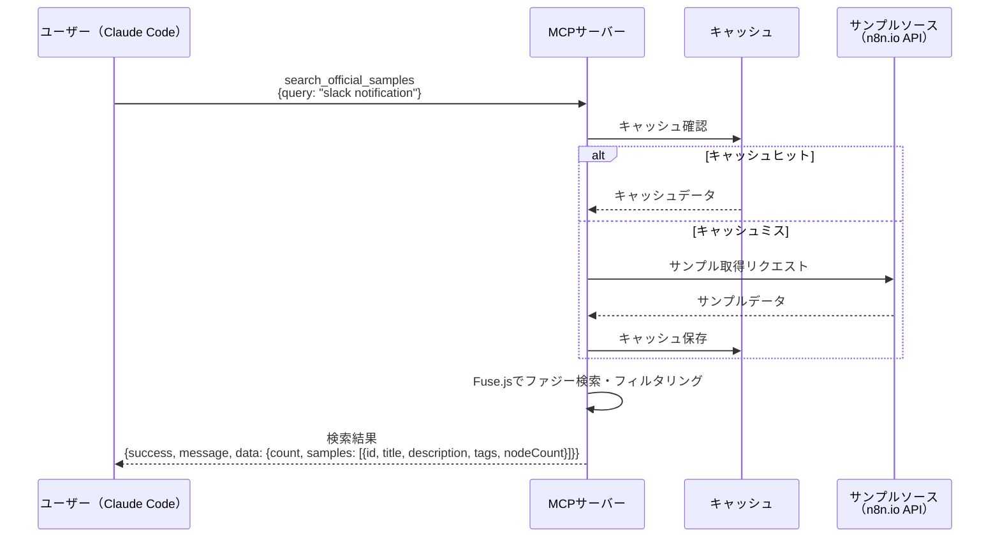
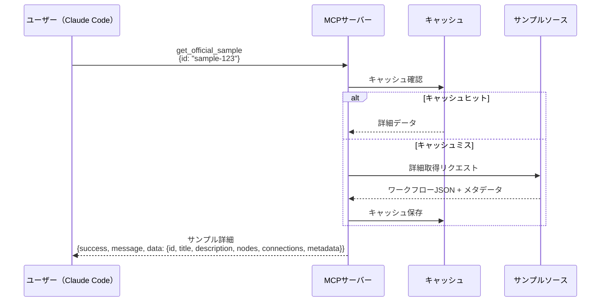
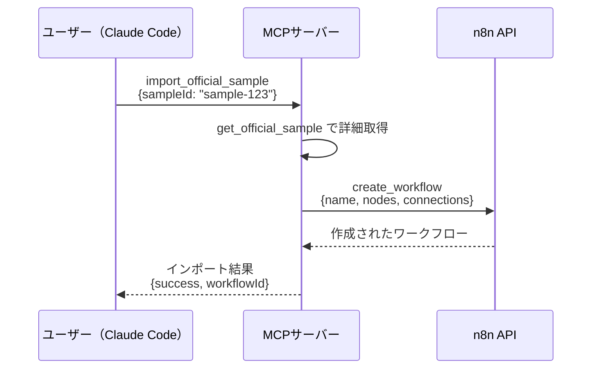

# プロジェクト全容ドキュメント

## プロジェクト概要
- **プロジェクト名**: 公式サンプル検索ツール (Official Sample Search Tool)
- **目的と背景**:
  - n8n公式ドキュメントや公式リポジトリから、実際のワークフローサンプルを検索・取得できるツールを提供する
  - ユーザーが特定の機能やノードの使用例を素早く見つけられるようにする
  - 既存のMCPサーバーに新しいツールとして統合する
- **主要な目標**:
  - ユーザーが「n8nでSlack通知を送る方法」などの検索クエリで、関連する公式サンプルを取得できる
  - サンプルワークフローのJSON定義とメタデータ（説明、使用ノード、タグなど）を返す
  - 検索したサンプルを直接n8nインスタンスにワークフローとしてインポートできる

## スコープ
### 対象範囲
- n8n公式サンプルの検索機能
- サンプルワークフローの詳細取得機能
- サンプルワークフローのインポート機能
- データソース: n8n.io公式API（Phase 1で存在確認とエンドポイント調査を実施）

### 対象外の範囲
- コミュニティ作成のワークフローの検索（公式のみを対象）
- サンプルワークフローの編集機能
- ワークフローの実行機能（既存のツールで対応）
- サンプルの評価・レーティング機能

## 主要機能

### 機能1: サンプルワークフロー検索
- キーワード、ノードタイプ、タグなどでn8n公式サンプルを検索
- 検索結果には各サンプルのサマリー（タイトル、説明、使用ノード数、タグ）を返す

### 機能2: サンプルワークフロー詳細取得
- 特定のサンプルIDを指定して、完全なワークフロー定義（JSON）と詳細メタデータを取得
- 常に完全なデータを返す（rawオプションなし、シンプルな実装）

### 機能3: サンプルワークフローのインポート
- 検索したサンプルを直接n8nインスタンスにワークフローとして作成
- create_workflow APIを使用

## Phase概要と依存関係

### Phase 1: 調査・設計フェーズ
- **開始日時**:
- **状態**: 未着手
- **目標**:
  - n8n.io公式APIの存在確認とエンドポイント調査
  - API認証要件の調査（API Key必要性）
  - サンプルID形式の特定
  - サンプルデータスキーマの設計
- **依存関係**: なし
- **成果物**:
  - n8n.io API調査レポート（エンドポイント、認証方法、レスポンス形式）
  - サンプルデータスキーマ定義
  - 技術選定ドキュメント

### Phase 2: コア検索機能実装
- **開始日時**:
- **状態**: 未着手
- **目標**:
  - n8n.io APIクライアントの実装（Axios使用）
  - キャッシュ機構の実装（node-cache、TTL: 24時間）
  - Fuse.jsによるファジー検索の実装
  - 検索ツール（search_official_samples）の実装
  - サンプル詳細取得ツール（get_official_sample）の実装
- **依存関係**: Phase 1のAPI調査とスキーマ設計の完了が必須
- **成果物**:
  - OfficialSampleClient（n8n.io API通信）
  - SampleCache（node-cache wrapper）
  - 2つの新規MCPツール
  - ユニットテスト

### Phase 3: インポート機能実装
- **開始日時**:
- **状態**: 未着手
- **目標**:
  - サンプルインポートツール（import_official_sample）の実装
  - 既存のcreate_workflow APIとの統合
  - エラーハンドリングの強化
- **依存関係**: Phase 2の検索機能実装完了が必須
- **成果物**:
  - import_official_sampleツール
  - 統合テスト

## Phase依存関係図
```
Phase 1 (調査・設計)
    ↓
Phase 2 (コア検索機能実装)
    ↓
Phase 3 (インポート機能実装)
```

## シーケンス図

### サンプルワークフロー検索


### サンプルワークフロー詳細取得


### サンプルインポート


## 成果物
- **MCPツール**:
  - `search_official_samples`: 公式サンプルを検索
  - `get_official_sample`: サンプル詳細を取得
  - `import_official_sample`: サンプルをn8nにインポート
- **内部コンポーネント**:
  - OfficialSampleClient (n8n.io API通信、Axios使用)
  - SampleCache (node-cache wrapper、TTL: 24時間)
  - Fuse.jsファジー検索エンジン
- **ドキュメント**:
  - 各ツールの使用方法
  - データソース仕様
- **テストスイート**:
  - ユニットテスト
  - 統合テスト

## リスクと制約

### リスク
1. **データソースの制約**:
   - n8n.io公式APIの存在が未確認（Phase 1で調査が必須）
   - APIが存在しない場合、代替案（スクレイピング、GitHub API）の検討が必要
   - API仕様変更によるツール動作停止のリスク

2. **データ鮮度**:
   - キャッシュTTL 24時間のため、最新サンプルの反映に遅延
   - 手動キャッシュクリア機能の必要性

3. **検索精度**:
   - Fuse.jsのファジー検索設定（threshold値）のチューニングが必要
   - サンプル数が多い場合、検索パフォーマンスの低下

### 技術的制約
- n8n.io APIの存在と仕様がPhase 1調査まで未確定
- 既存のMCPサーバーアーキテクチャに準拠する必要がある
- node-cacheによるメモリ内キャッシュのため、プロセス再起動でキャッシュ消失

### ビジネス的制約
- n8n公式のポリシーと利用規約に準拠する必要がある
- APIレート制限の有無は Phase 1で調査が必要
