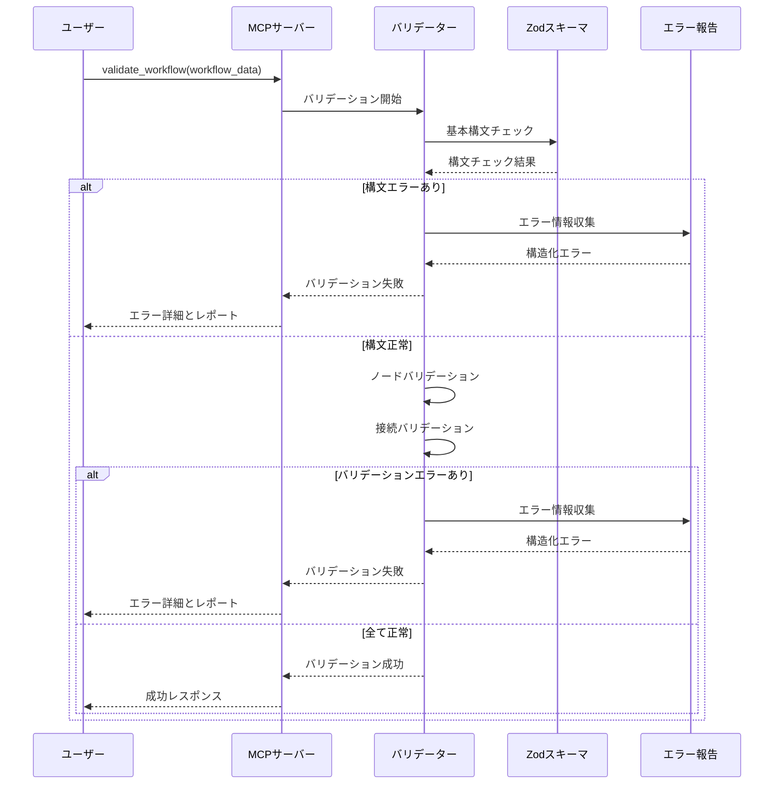
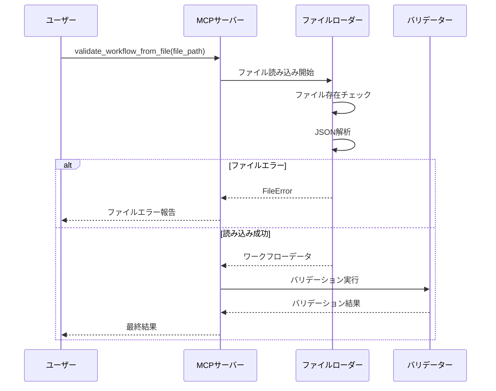

# プロジェクト全容ドキュメント

## プロジェクト概要
- **プロジェクト名**: n8n Workflow Syntax Validator
- **目的と背景**:
  - n8nワークフローの構文を事前にチェックし、エラーを早期発見する
  - ワークフロー作成時の品質向上とデバッグ時間の短縮を実現する
  - 既存のn8n MCP serverに統合し、AI支援によるワークフロー開発を強化する
  - **重要発見**: czlonkowski/n8n-mcp（9.5k stars）が既に包括的なvalidation実装を提供済み
- **主要な目標**:
  - **既存実装の分析と学習**: czlonkowski/n8n-mcpのvalidation実装を詳細分析
  - **参考実装としての活用**: 高度なvalidation機能の実装方法を学習
  - **我々のMCPサーバーへの統合**: 学習した手法を我々のアーキテクチャに適用
  - **czlonkowski/n8n-mcpから学ぶ要素**:
    - WorkflowValidatorクラスの設計パターン
    - プロファイルベース検証（minimal/runtime/ai-friendly/strict）
    - AI特化ノードの検証手法
    - エラー修復提案システム
    - 高速化手法（12msレスポンス）

## プロジェクトステータス
- **ステータス**: 未着手

## スコープ
### 対象範囲
- n8nワークフローJSONの構文チェック機能
- ノード定義の妥当性検証
- 接続関係の整合性チェック
- パラメータ値のバリデーション
- MCPツールとしての統合
- ファイル入力とJSON入力の両方に対応
- 詳細なエラー報告とログ機能

### 対象外の範囲
- ワークフローの実行機能
- n8nサーバーとの直接連携（既存のn8n clientを使用）
- ワークフローの自動修正機能（提案のみ）
- リアルタイム構文チェック（バッチ処理のみ）
- ワークフロー最適化機能

## 主要機能
### 1. 基本構文バリデーション
- ワークフロー構造の妥当性チェック（name, nodes, connections必須フィールド）
- JSON形式の妥当性検証
- 必須フィールドの存在確認

### 2. ノードバリデーション
- ノードタイプの妥当性チェック
- ノード固有のパラメータバリデーション
- 位置情報とID重複チェック
- 無効なノード参照の検出

### 3. 接続バリデーション
- ノード間接続の整合性チェック
- 存在しないノードへの参照検出
- 循環参照の検出
- 入出力タイプの互換性チェック

### 4. 高度なバリデーション
- 条件分岐ノードの接続パターンチェック
- ループ構造の妥当性検証
- サブワークフローの整合性チェック

### 5. エラー報告機能
- 構造化されたエラーレポート
- エラーの重要度分類（Error, Warning, Info）
- 修正提案の提供
- 複数エラーの効率的な表示

## Phase概要と依存関係

### Phase 1: 基盤設計とコア機能実装
- **開始日時**: （未着手の場合は空欄）
- **状態**: 未着手
- **目標**:
  - 基本的なバリデーション機能の実装
  - MCPツールとしての基盤構築
  - Zodスキーマの拡張とバリデーションエンジンの構築
- **依存関係**: なし
- **成果物**:
  - validate_workflowツールの基本実装
  - 拡張されたZodスキーマ
  - エラーハンドリングシステム
  - 基本テストスイート

### Phase 2: 高度なバリデーション機能
- **開始日時**: （未着手の場合は空欄）
- **状態**: 未着手
- **目標**:
  - ノードタイプ固有のバリデーション実装
  - 複雑な接続パターンのチェック機能
  - パフォーマンス最適化
- **依存関係**: Phase 1の基盤機能完了が必須
- **成果物**:
  - ノードタイプ別バリデーションルール
  - 接続パターン検証エンジン
  - パフォーマンステストスイート
  - 詳細なエラー分類システム

### Phase 3: ユーザビリティとエラー報告強化
- **開始日時**: （未着手の場合は空欄）
- **状態**: 未着手
- **目標**:
  - 分かりやすいエラーメッセージの実装
  - 修正提案機能の追加
  - バリデーション結果の可視化
- **依存関係**: Phase 2のバリデーション機能完了が必須
- **成果物**:
  - 改善されたエラー報告システム
  - 修正提案エンジン
  - バリデーション結果のフォーマッター
  - ユーザビリティテストレポート

### Phase 4: 統合とドキュメント化
- **開始日時**: （未着手の場合は空欄）
- **状態**: 未着手
- **目標**:
  - 既存MCPサーバーへの完全統合
  - 包括的なドキュメント作成
  - 本番環境での動作検証
- **依存関係**: Phase 3のユーザビリティ機能完了が必須
- **成果物**:
  - 統合されたMCPサーバー
  - API仕様書とユーザーガイド
  - デプロイメントガイド
  - 運用監視機能

## Phase依存関係図
```
Phase 1 (基盤設計とコア機能)
    ↓
Phase 2 (高度なバリデーション)
    ↓
Phase 3 (ユーザビリティ強化)
    ↓
Phase 4 (統合とドキュメント化)
```

## シーケンス図

### 基本的なバリデーション処理フロー


### ファイル入力処理フロー


## 成果物
### 最終的な成果物一覧
1. **validate_workflow MCPツール**
   - JSON入力対応のバリデーション機能
   - 包括的なエラー報告システム

2. **validate_workflow_from_file MCPツール**
   - ファイル入力対応のバリデーション機能
   - 既存のファイルローダーとの統合

3. **拡張されたバリデーションスキーマ**
   - ノードタイプ固有のルール
   - 接続パターンの検証ルール
   - カスタムバリデーション関数

4. **エラー報告システム**
   - 構造化されたエラーレスポンス
   - 修正提案機能
   - エラーの重要度分類

5. **テストスイートとドキュメント**
   - 包括的なテストケース
   - API仕様書
   - ユーザーガイド

## リスクと制約
### 想定されるリスク
- **技術的リスク**:
  - n8nのノードタイプ定義の変更によるバリデーションルールの陳腐化
  - 大規模ワークフローでのパフォーマンス問題
  - 複雑な接続パターンの見落とし

- **運用リスク**:
  - バリデーションルールの過度な厳格化によるユーザビリティ低下
  - エラーメッセージの分かりにくさ
  - 既存ワークフローとの互換性問題

### 技術的制約
- 既存のn8n MCP serverアーキテクチャに準拠
- Zodライブラリの制約内でのバリデーション実装
- MCPプロトコルの仕様に従ったツール設計

### ビジネス的制約
- **不明**: バリデーション処理の応答時間要件（案A: 1秒以内、案B: 5秒以内、案C: 応答時間制限なし）
- **不明**: サポートするワークフローの最大サイズ（案A: 100ノード、案B: 500ノード、案C: 制限なし）
- **不明**: エラー報告の詳細度レベル（案A: 簡潔、案B: 詳細、案C: カスタマイズ可能）
